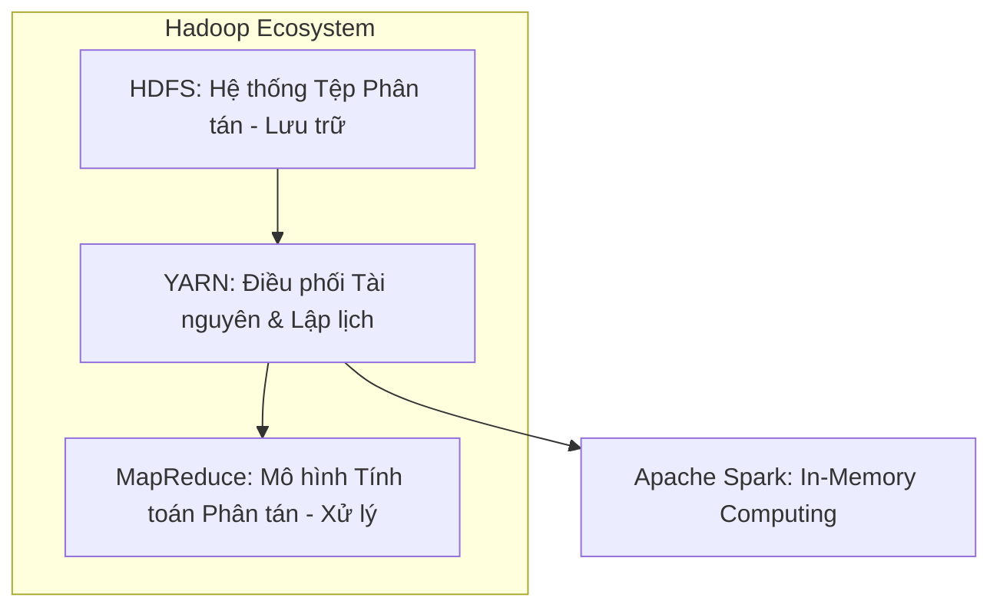
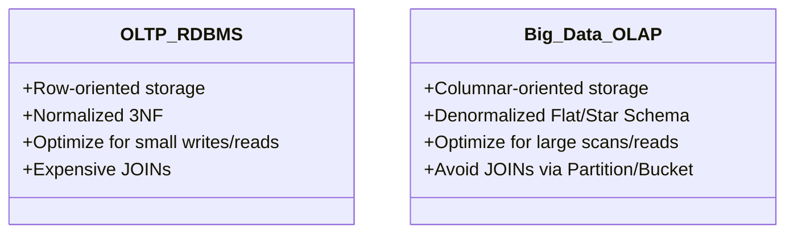

# 🧠 Learning Log - TradeStream

*Nhật ký học tập dành cho bộ não ADHD. Chỉ ghi những gì thực sự hiểu và thấy thú vị. Không cần văn hoa, copy/paste thoải mái.*

---

## 🧠 LÝ THUYẾT CỐT LÕI

### 1. OLTP (Hệ thống giao dịch) vs OLAP (Hệ thống phân tích)
* **OLTP (Online Transaction Processing)**:
  * **Mục đích**: Phục vụ các ứng dụng vận hành hàng ngày (mua hàng, chuyển tiền, tạo tài khoản). Yêu cầu đọc/ghi dữ liệu cực nhanh trên từng bản ghi (dòng).
  * **Thiết kế**: Chuẩn hóa tối đa (thường là chuẩn 3NF) để tránh trùng lặp dữ liệu và đảm bảo tính toàn vẹn (ACID).
  * **Đại diện**: PostgreSQL thông thường, MySQL, Oracle.
* **OLAP (Online Analytical Processing)**:
  * **Mục đích**: Phục vụ phân tích, báo cáo dữ liệu lớn (BI, Dashboard). Yêu cầu đọc và tính toán (SUM, AVG, COUNT) hàng triệu hoặc hàng tỷ dòng cùng lúc trong thời gian ngắn nhất.
  * **Thiết kế**: Phi chuẩn hóa (Denormalized) hoặc mô hình hóa theo dạng hình sao/bông tuyết để tối ưu hóa việc đọc dữ liệu hàng loạt.
  * **Đại diện**: ClickHouse, Trino, Snowflake, BigQuery, AWS Redshift.

---

### 2. Mô hình hóa dữ liệu OLAP: Fact & Dimension Tables
Trong một kho dữ liệu (Data Warehouse) hay hồ dữ liệu (Data Lakehouse), dữ liệu không lưu ở dạng "bảng phẳng" hỗn độn mà được chia rõ rệt thành 2 loại bảng:

```
                  ┌──────────────────────┐
                  │   DIMENSION TABLE    │ (Mô tả thực thể)
                  │  (dim_assets, dim_date)│ "Ai? Cái gì? Khi nào?"
                  └──────────┬───────────┘
                             │ (1-n)
                             ▼
                  ┌──────────────────────┐
                  │     FACT TABLE       │ (Giao dịch/Chỉ số đo lường)
                  │  (fact_daily_prices) │ "Giá bao nhiêu? Volume thế nào?"
                  └──────────────────────┘
```

* **Fact Table (Bảng Sự Kiện)**:
  * Lưu trữ các **sự kiện xảy ra**, các chỉ số đo lường số lượng (metrics) của hệ thống.
  * Thường chứa các cột dữ liệu số để tính toán (như `open_price`, `close_price`, `volume`, `daily_return`) và các khoá ngoại (Foreign Keys) để liên kết với các bảng chiều thông tin.
  * **Đặc điểm**: Rất nhiều dòng (tăng trưởng rất nhanh theo thời gian) nhưng ít cột, dữ liệu chủ yếu là số.
* **Dimension Table (Bảng Chiều Thông Tin)**:
  * Lưu trữ các thông tin mô tả chi tiết, **ngữ cảnh** xung quanh sự kiện (Who, What, Where, When, Why).
  * Ví dụ: Bảng Dimension về Tài sản (`symbol`, `asset_name`, `exchange`, `sector`), bảng Dimension về Thời gian (`date`, `day_of_week`, `quarter`, `year`).
  * **Đặc điểm**: Ít dòng hơn nhưng rất nhiều cột, chủ yếu là dữ liệu chữ (text) phục vụ cho việc lọc (Filter) và gom nhóm (Group By) trên dashboard.

---

### 3. Star Schema vs Snowflake Schema
Khi tổ chức các bảng Fact và Dimension với nhau, chúng ta có hai mô hình thiết kế kinh điển:

#### 📊 Star Schema (Sơ đồ hình sao) - "Vua" của thế giới OLAP
* **Cấu trúc**: Fact table nằm ở trung tâm, các bảng Dimension bao quanh và kết nối trực tiếp đến Fact table qua 1 liên kết duy nhất (1 hop).
* **Đặc điểm**: Bảng Dimension được thiết kế **phi chuẩn hóa (Denormalized)**. Tức là chấp nhận trùng lặp dữ liệu (ví dụ: thông tin `country` và `sector` của Asset được lưu trực tiếp trong bảng Asset Dimension thay vì tách riêng).
* **Ưu điểm**:
  * **Tốc độ truy vấn siêu nhanh**: Để lấy dữ liệu vẽ biểu đồ, query engine chỉ cần thực hiện đúng **1 lần JOIN** giữa Fact table và Dimension table tương ứng.
  * **Dễ hiểu, dễ thiết kế**: Cực kỳ trực quan cho cả kỹ sư dữ liệu lẫn người làm báo cáo.
* **Nhược điểm**: Tốn dung lượng lưu trữ hơn vì dữ liệu trong bảng Dimension bị trùng lặp nhiều.

#### ❄️ Snowflake Schema (Sơ đồ bông tuyết)
* **Cấu trúc**: Là biến thể của Star Schema nhưng các bảng Dimension được **chuẩn hóa (Normalized)** triệt để bằng cách chia nhỏ ra thành nhiều bảng phụ hơn nữa.
* **Ví dụ**: Bảng `dim_assets` không lưu tên ngành và quốc gia nữa, mà tách thành bảng `dim_sectors` và `dim_countries` riêng, rồi nối tiếp vào `dim_assets`.
* **Ưu điểm**: Tiết kiệm dung lượng ổ cứng vì loại bỏ hoàn toàn dữ liệu trùng lặp.
* **Nhược điểm**:
  * **Hiệu năng truy vấn rất tệ**: Khi cần báo cáo, câu lệnh SQL sẽ phải thực hiện **JOIN lồng nhiều tầng (multi-hop)**, khiến hệ thống chạy rất nặng và chậm trên tập dữ liệu lớn.

---

### 4. Áp dụng thực tế vào TradeStream Analytics Pipeline
Hiện tại, bảng dữ liệu `daily_prices` của chúng ta trong TimescaleDB thực chất đang là một **Bảng Phẳng (Denormalized Flat Table)** - chứa tuốt tuột cả giá, volume, loại tài sản, tiền tệ vào chung một bảng. 

Khi chúng ta chuyển sang **Phase 3 (Lakehouse)** sắp tới, chúng ta sẽ thiết kế lại dữ liệu theo mô hình **Star Schema** chuẩn mực:

1. **Bảng Dimension 1: `dim_assets` (Lưu thông tin tài sản)**
   * Cột: `asset_key` (Primary Key), `symbol`, `asset_name`, `asset_type` (stock/crypto), `currency`, `exchange`.
2. **Bảng Dimension 2: `dim_date` (Lưu thông tin thời gian phân tích)**
   * Cột: `date_key` (Primary Key, VD: `20260518`), `date_actual`, `day_of_week`, `day_name`, `month`, `quarter`, `year`, `is_weekend`.
3. **Bảng Fact: `fact_daily_prices` (Lưu giá giao dịch hàng ngày)**
   * Cột: `fact_id` (Primary Key), `date_key` (Foreign Key -> `dim_date`), `asset_key` (Foreign Key -> `dim_assets`), `open_price`, `high_price`, `low_price`, `close_price`, `volume`, `daily_return`, `price_range`.

Khi viết code PySpark xử lý dữ liệu từ Kafka, Spark sẽ làm nhiệm vụ **phân rã dữ liệu thô** ra để ghi vào đúng các bảng Fact và Dimension này trong Lakehouse (lưu trên MinIO thông qua Apache Iceberg).

---

### 5. ETL (Extract - Transform - Load) vs ELT (Extract - Load - Transform)
Trong các dự án dữ liệu lớn, việc di chuyển và biến đổi dữ liệu có hai trường phái thiết kế chính:

* **ETL (Trường phái truyền thống)**:
  * **Quy trình**: Rút trích dữ liệu thô từ nguồn (E) -> Biến đổi, tính toán, làm sạch dữ liệu trên một server trung gian (T) -> Load dữ liệu đã sạch vào Data Warehouse đích (L).
  * **Tại sao ra đời?** Trong quá khứ, dung lượng lưu trữ trên Data Warehouse cực kỳ đắt đỏ. Vì vậy, ta buộc phải "gọt giũa" dữ liệu thật sạch sẽ trước khi lưu trữ để tiết kiệm ổ cứng.
  * **Điểm yếu**: Nếu logic biến đổi bị lỗi hoặc sau này ta muốn phân tích thêm một chỉ số mới từ dữ liệu gốc, ta **không thể làm được** vì dữ liệu thô ban đầu đã bị loại bỏ/gọt sạch.
* **ELT (Trường phái hiện đại - Big Data & Lakehouse)**:
  * **Quy trình**: Rút trích dữ liệu thô (E) -> Load thẳng dữ liệu thô, nguyên bản vào Data Lake/Object Storage (L) -> Sử dụng các công cụ tính toán phân tán (như Spark, Trino) để biến đổi dữ liệu trực tiếp trên hồ dữ liệu khi cần (T).
  * **Tại sao ra đời?** Hiện nay dung lượng lưu trữ trên Cloud/Object Storage (MinIO, S3) siêu rẻ.
  * **Điểm mạnh vượt trội**: Chúng ta luôn giữ lại **dữ liệu gốc lịch sử (Raw Data)**. Nếu logic tính toán bị sai hoặc nghiệp vụ thay đổi, ta chỉ cần chạy lại bước Transform trên dữ liệu thô đã lưu mà không cần gọi lại API nguồn để lấy dữ liệu.

#### 🏅 Phân tích Quy trình Xử lý Dữ liệu 3 Tầng: Bronze ➡️ Silver ➡️ Gold (Kiến trúc Medallion)
Trong Data Lakehouse hiện đại, dữ liệu không được xử lý "một phát ăn ngay" mà được dịch chuyển và nâng cấp chất lượng qua 3 vùng lưu trữ vật lý riêng biệt:

```
┌──────────────────┐      ┌───────────────────┐      ┌──────────────────┐
│   BRONZE (Raw)   │ ───> │  SILVER (Cleaned) │ ───> │ GOLD (Aggregated)│
│  MinIO (JSON)    │ Spark│ MinIO (Iceberg)   │Trino │ MinIO / Serving  │
│  Append-Only     │      │ Star Schema       │      │ BI, ML, Dashboard│
└──────────────────┘      └───────────────────┘      └──────────────────┘
```

##### 1. Tầng Bronze (Raw Layer) - Hồ Chứa Thô
* **Nguồn dữ liệu**: Dữ liệu được kéo trực tiếp từ Kafka Topic hoặc gọi API nguồn và lưu thẳng vào Object Storage (MinIO) ở dạng nguyên bản nhất.
* **Định dạng lưu trữ**: JSON thô, CSV, hoặc nén thành Parquet thô.
* **Đặc điểm xử lý**:
  * **Append-Only & Immutable**: Chỉ ghi thêm, không bao giờ được phép sửa hay xóa dữ liệu ở tầng này. Dữ liệu thô là "nguồn sự thật lịch sử duy nhất".
  * **Partitioning (Phân vùng)**: Thường được chia thư mục theo ngày nạp dữ liệu (`ingest_year=2026/ingest_month=05/ingest_day=18/`). Việc này giúp Spark hoặc Trino sau này chỉ cần quét đúng thư mục của ngày cần xử lý thay vì quét toàn bộ hồ dữ liệu, và cực kỳ thuận tiện cho việc chạy lại (Backfill) dữ liệu lịch sử.
  * **Chất lượng**: Dữ liệu cực kỳ "bẩn", chứa bản ghi trùng lặp do mạng chập chờn (lỗi bắn đúp tin nhắn của Kafka), dữ liệu null hoặc sai định dạng.

##### 2. Tầng Silver (Cleaned & Modeled Layer) - Bộ Lọc Chất Lượng
* **Vai trò**: Đây là nơi diễn ra các tác vụ xử lý dữ liệu (Transformation) nặng nhất của Data Engineer bằng Spark. Dữ liệu từ tầng Bronze được chuyển đổi thành dữ liệu có cấu trúc đáng tin cậy.
* **Định dạng lưu trữ**: Apache Iceberg (hoặc Delta Lake/Hudi) để hỗ trợ tính năng ACID, schema evolution (tự động cập nhật cột mới mà không hỏng bảng) và time travel (truy vấn ngược lịch sử bảng).
* **Quy trình xử lý chi tiết (Spark Job)**:
  1. **Schema Enforcement (Áp schema)**: Ép kiểu dữ liệu thô sang đúng kiểu dữ liệu chuẩn (ví dụ: `fetch_date` chuyển từ String sang Date, `close_price` chuyển sang Double/Decimal). Dòng nào sai định dạng quá nặng sẽ bị loại ra vùng chứa lỗi (Dead Letter Queue - DLQ).
  2. **Data Cleansing (Làm sạch)**: Loại bỏ các bản ghi bị khuyết thiếu (null) ở các cột quan trọng (ví dụ: dòng giá mà không có `close_price` thì không dùng được, phải drop).
  3. **Deduplication (Lọc trùng)**: Dựa trên các cột định danh duy nhất (khóa doanh nghiệp) để giữ lại 1 bản ghi chính xác nhất cho mỗi tài sản mỗi ngày.
  4. **Data Modeling (Mô hình hóa)**: Đây là bước then chốt. Spark sẽ tách cấu trúc "bảng phẳng" thô ban đầu ra làm các bảng **Fact và Dimension** (như `fact_daily_prices`, `dim_assets`, `dim_date`) theo mô hình **Star Schema** để tối ưu hóa hiệu năng truy vấn cho các bước sau.

##### 3. Tầng Gold (Aggregated Layer) - Phục Vụ Kinh Doanh
* **Vai trò**: Tầng Gold chứa các dữ liệu đã được **tổng hợp sâu (Aggregated)**, sẵn sàng cho người dùng cuối (Business Analyst, Data Scientist) truy vấn vẽ biểu đồ hoặc chạy mô hình AI.
* **Định dạng lưu trữ**: Thường là Apache Iceberg hoặc được đồng bộ trực tiếp sang Serving Database (như TimescaleDB) để đạt tốc độ phản hồi mili-giây cho Dashboard.
* **Đặc điểm xử lý**:
  * Chạy các câu lệnh SQL tổng hợp phức tạp (như tính toán trung bình giá theo tuần, theo tháng, các chỉ báo kỹ thuật SMA, EMA, RSI).
  * **Cơ chế ghi**: Thường dùng cơ chế **Overwrite** (ghi đè kết quả tính toán mới nhất) hoặc **Upsert** (cập nhật dòng mới nếu có sự thay đổi).
  * Dữ liệu ở tầng này cực kỳ "sạch" và gọn nhẹ, tốc độ truy vấn cực nhanh.

---

### 6. Data Quality (Chất lượng dữ liệu) - Trọng tâm của Data Engineer
Hệ thống dữ liệu chạy nhanh đến đâu cũng vô dụng nếu dữ liệu đầu ra bị sai, bị thiếu hoặc bị trùng lặp. Data Quality là quá trình đảm bảo tính đáng tin cậy của dữ liệu qua **6 chiều kích thước tiêu chuẩn (6 Dimensions of Data Quality)**:

1. **Completeness (Tính đầy đủ)**: Dữ liệu có bị thiếu các trường quan trọng không? (Ví dụ: Một dòng giá cổ phiếu không thể bị khuyết mất cột `close_price`).
2. **Uniqueness (Tính duy nhất)**: Dữ liệu có bị nhân bản/trùng lặp không? (Ví dụ: Một mã cổ phiếu trong một ngày chỉ được phép có 1 dòng dữ liệu duy nhất).
3. **Accuracy (Tính chính xác)**: Dữ liệu có đúng với thực tế không? (Ví dụ: Giá cổ phiếu hay volume giao dịch không bao giờ được phép là số âm).
4. **Validity (Tính hợp lệ)**: Dữ liệu có tuân thủ đúng định dạng/kiểu dữ liệu quy định không? (Ví dụ: Ngày tháng phải tuân theo định dạng `YYYY-MM-DD`, mã tài sản phải viết hoa).
5. **Consistency (Tính nhất quán)**: Dữ liệu ở các nơi khác nhau phải khớp nhau (Ví dụ: Giá Close của AAPL trên Dashboard Grafana phải khớp hoàn toàn với dữ liệu lưu trong TimescaleDB).
6. **Timeliness (Tính kịp thời)**: Dữ liệu có được cập nhật đúng thời gian mong muốn không? (Ví dụ: Batch processing hàng ngày phải hoàn tất trước giờ mở cửa sàn giao dịch).

#### 🛠️ Áp dụng Data Quality vào TradeStream thế nào?
* **Hiện tại (Code-level checks)**:
  * Đảm bảo **Validity**: Spark định nghĩa sẵn `StructType` schema để ép kiểu và chỉ parse các JSON hợp lệ từ Kafka.
  * Đảm bảo **Uniqueness**: Thiết lập UNIQUE CONSTRAINT `(symbol, fetch_date)` trong TimescaleDB và thực hiện cơ chế *Delete-then-Insert* trong PySpark để loại bỏ trùng lặp nếu chạy lại batch.
* **Tương lai (Framework-level checks)**:
  * Trong Phase 8, chúng ta sẽ tích hợp **Great Expectations** (thư viện kiểm định chất lượng dữ liệu hàng đầu của Python). Thư viện này sẽ định nghĩa các quy tắc kiểm tra tự động trước khi đẩy dữ liệu lên Serving Layer. Nếu dữ liệu vi phạm (Ví dụ: phát hiện giá Close bị âm hoặc Null), Airflow sẽ dừng pipeline và gửi cảnh báo đỏ ngay lập tức.

---

### 7. KIẾN THỨC SQL CHUYÊN SÂU DÀNH CHO DATA ENGINEER

SQL là ngôn ngữ giao tiếp bắt buộc của mọi kỹ sư dữ liệu. Dưới đây là các chủ đề nâng cao cần nắm vững:

#### A. Các loại JOIN và cơ chế chạy trong hệ thống phân tán
* **Các loại JOIN cơ bản**:
  * `INNER JOIN`: Chỉ lấy các bản ghi có khóa khớp ở cả hai bảng.
  * `LEFT JOIN` (Rất hay dùng): Lấy toàn bộ bảng bên trái và dữ liệu khớp của bảng bên phải (nếu không khớp sẽ để `Null`). Phù hợp khi giữ nguyên Fact table và bổ sung chiều thông tin từ Dimension table.
  * `RIGHT JOIN`: Ngược lại với LEFT JOIN.
  * `FULL OUTER JOIN`: Lấy toàn bộ dữ liệu của cả hai bảng, chỗ nào không khớp thì điền `Null`.
  * `CROSS JOIN` (Tích Descartes): Nối mọi dòng của bảng A với mọi dòng của bảng B (Cực kỳ nguy hiểm nếu bảng lớn vì gây bùng nổ số lượng dòng dữ liệu).
* **Cơ chế JOIN trong hệ thống phân tán (Spark SQL)**:
  * Khi JOIN hai bảng trên nhiều máy chủ (Executor), hệ thống phải di chuyển dữ liệu qua mạng. Có hai cơ chế chính:
    1. **Shuffle Hash Join (Chậm ❌)**: Dùng khi cả hai bảng đều lớn. Spark phải băm (hash) khóa JOIN và di chuyển dữ liệu của cả 2 bảng qua mạng (Shuffle) để các bản ghi có cùng khóa hội quân tại một Executor. Quá trình này tốn rất nhiều tài nguyên mạng và I/O.
    2. **Broadcast Join / Map-side Join (Siêu nhanh ✅)**: Khi một trong hai bảng rất nhỏ (Ví dụ: bảng Dimension `dim_assets` chỉ có 4 dòng) và bảng kia siêu to. Spark sẽ "phát sóng" (broadcast) copy toàn bộ bảng nhỏ gửi đến tất cả Executor. Việc JOIN lúc này diễn ra ngay tại bộ nhớ cục bộ của từng Executor mà không cần Shuffle bảng to qua mạng.

#### B. Window Functions (Hàm cửa sổ - Trái tim của phân tích chuỗi thời gian)
* **Định nghĩa**: Thực hiện tính toán trên một tập hợp các dòng dữ liệu liên quan đến dòng hiện tại (gọi là "cửa sổ" - window), nhưng khác với `GROUP BY`, nó **không gộp dòng** mà giữ nguyên số dòng ban đầu.
* **Cú pháp**: `<Hàm tính toán> OVER (PARTITION BY <cột chia nhóm> ORDER BY <cột sắp xếp>)`
* **Các hàm kinh điển trong phân tích tài chính**:
  1. `LAG(cột, n)` / `LEAD(cột, n)`: Lấy giá trị của dòng đứng trước/sau nó `n` bước.
     * *Ứng dụng*: Tính mức tăng trưởng giá so với ngày hôm trước:
       ```sql
       SELECT 
         symbol, fetch_date, close_price,
         LAG(close_price, 1) OVER (PARTITION BY symbol ORDER BY fetch_date) as yesterday_close
       FROM daily_prices;
       ```
  2. `ROW_NUMBER()`, `RANK()`, `DENSE_RANK()`: Đánh số thứ tự và xếp hạng dữ liệu.
     * `ROW_NUMBER()`: Đánh số 1, 2, 3 tăng dần bất kể giá trị trùng nhau.
     * `RANK()`: Đánh số 1, 2, 2, 4 (nếu hai dòng trùng hạng 2, dòng tiếp theo nhảy lên hạng 4).
     * `DENSE_RANK()`: Đánh số 1, 2, 2, 3 (không bỏ qua số thứ tự xếp hạng).
  3. `AVG(cột) OVER (...)`: Tính trung bình trượt (Moving Average).
     * *Ứng dụng*: Tính toán SMA 5 ngày gần nhất cho các mã tài sản.

#### C. Stored Procedures & Functions (Thủ tục & Hàm trong DB)
* **Stored Procedure (Thủ tục lưu trữ)**: Tập hợp các câu lệnh SQL được lưu và thực thi trực tiếp trên Database. Có thể nhận tham số truyền vào và thực thi các logic nghiệp vụ phức tạp, ghi nhật ký, commit transaction.
* **Stored Function (Hàm lưu trữ)**: Tương tự như Procedure nhưng bắt buộc phải trả về một giá trị đơn (hoặc một bảng kết quả) và có thể gọi trực tiếp trong câu lệnh `SELECT` (Ví dụ: `SELECT calculate_return(close, open) FROM daily_prices`).
* **Quyết định kiến trúc: Tính toán ở Database hay Application Layer?**
  * **Database-side (Procedures/Functions)**:
    * *Ưu điểm*: Tiết kiệm băng thông vì tính toán ngay trên đĩa/bộ nhớ của DB, không cần kéo dữ liệu thô ra ngoài mạng.
    * *Nhược điểm*: Khó mở rộng quy mô (Scale-up database rất đắt đỏ), khó viết Unit Test, khó quản lý phiên bản (Git/CI-CD).
  * **Application-side (Spark/Python)**:
    * *Ưu điểm*: Dễ mở rộng quy mô (chạy phân tán trên nhiều Worker rẻ tiền), dễ viết test, dễ debug và quản lý code bằng Git.
    * *Nhược điểm*: Phải kéo dữ liệu thô từ DB qua mạng về compute cluster để tính toán.
  * *Quy tắc vàng*: Dữ liệu lớn (Big Data) -> tính toán bằng Spark/Application. Dữ liệu nhỏ, giao dịch ACID chặt chẽ -> xử lý bằng Database.

#### D. Tối ưu hóa truy vấn và Đọc Execution Plan (Bản kế hoạch thực thi)
Khi viết SQL, bạn chỉ nói với Database: *"Tôi muốn lấy dữ liệu gì"*, chứ không nói *"Hãy tìm nó như thế nào"*. Bộ tối ưu hóa (Optimizer) của DB sẽ tự vẽ ra một **Execution Plan** để tìm dữ liệu.
* **Cách xem bản kế hoạch**: Sử dụng cú pháp `EXPLAIN ANALYZE <câu_sql>;` trong PostgreSQL.
* **Các thuật ngữ cốt lõi cần đọc**:
  1. **Sequential Scan (Seq Scan - Chậm ❌)**: DB phải duyệt từ đầu đến cuối bảng để tìm dữ liệu (giống như lật từng trang sách để tìm từ khóa). Rất tệ khi bảng có hàng triệu dòng.
  2. **Index Scan (Nhanh ✅)**: DB sử dụng bảng mục lục (Index) để nhảy thẳng tới vị trí dòng cần tìm. Cực kỳ nhanh.
  3. **Hash Join / Merge Join / Nested Loop**: Các thuật toán mà DB dùng để JOIN các bảng dựa vào dung lượng bộ nhớ và kích thước của bảng.
* **Bí kíp tối ưu hóa SQL cho Data Engineer**:
  * Luôn tạo **Index** trên các cột dùng để `JOIN` hoặc filter (`WHERE`).
  * Tránh dùng `SELECT *`, chỉ chọn đúng các cột cần thiết để giảm tải I/O.
  * Sử dụng **Materialized Views** hoặc **Continuous Aggregates** (trong TimescaleDB) để tính toán sẵn các chỉ số tổng hợp định kỳ, giúp Dashboard load tức thì thay vì phải tính lại từ đầu mỗi lần mở trang.

---

### 8. KHÁI NIỆM CỐT LÕI VỀ DATA PIPELINE (ĐƯỜNG ỐNG DỮ LIỆU)

Một Data Pipeline là một chuỗi các bước tự động hóa việc thu thập, vận chuyển, làm sạch và lưu trữ dữ liệu. Các khái niệm cốt lõi bao gồm:

* **Batch Processing (Xử lý theo lô)**:
  * Dữ liệu được gom lại thành từng khối lớn và xử lý định kỳ (Ví dụ: chạy job lúc 12h đêm để xử lý dữ liệu của ngày hôm đó).
  * *Thích hợp*: Báo cáo tài chính, phân tích lịch sử, ML training.
* **Streaming Processing (Xử lý luồng/Thời gian thực)**:
  * Dữ liệu được xử lý ngay lập tức khi nó vừa phát sinh (Độ trễ tính bằng mili-giây).
  * *Thích hợp*: Phát hiện gian lận thẻ tín dụng, định giá động (Grab/Uber), theo dõi hệ thống.
* **Idempotency (Tính bất biến/Kháng trùng - Tối quan trọng)**:
  * Một pipeline được gọi là Idempotent nếu bạn chạy nó 1 lần hay 100 lần với cùng một tập dữ liệu đầu vào, kết quả đầu ra tại database đích vẫn không đổi và không bị trùng lặp.
  * *Tại sao cần?* Nếu pipeline đang chạy được 90% thì bị cúp điện/mất mạng. Khi chạy lại, tính idempotent đảm bảo hệ thống không bị ghi đè, nhân đôi dữ liệu gây sai lệch báo cáo. (Cách chúng ta dùng *Delete-then-Insert* trong Spark chính là để đảm bảo điều này).
* **Backfill (Bù dữ liệu)**:
  * Quy trình chạy lại pipeline trên một khoảng thời gian lịch sử trong quá khứ.
  * *Khi nào dùng?* Khi hệ thống bị mất kết nối mạng suốt 3 ngày qua (cần backfill dữ liệu 3 ngày đó), hoặc khi ta thay đổi công thức tính chỉ số tài chính mới và muốn áp dụng ngược lại cho dữ liệu của cả năm ngoái.

---

## Phase 0: Foundation

### Ngày 1 (Hôm nay)
- Đã khởi động dự án dù năng lượng thấp.
- Đã có hệ thống tracking tự động bằng AI Mentor.
- **Bài học rút ra**: Không cần phải lúc nào cũng 100% năng lượng. Những ngày mệt mỏi, làm việc nhỏ (như setup docs) vẫn tốt hơn là không làm gì. Pipeline vẫn ở đó chờ mình.
- **Kiến thức**: Sự khác biệt giữa REST API (Polling) và WebSocket. 
  - **REST API**: Khách chủ động hỏi, Server trả lời (VD: Liên tục gọi điện hỏi "Pizza xong chưa?"). Dùng để lấy giá Stock từ Yahoo Finance mỗi 1 phút.
  - **WebSocket**: Mở kết nối 1 lần, Server tự động đẩy data về (VD: Nhà hàng tự gọi báo "Pizza xong rồi"). Dùng để lấy giá Crypto real-time từ Binance.
- **Business Insight**: Tại sao Yahoo Finance (Stock) dùng REST API thay vì WebSocket như Binance (Crypto)?
  1. **Giờ hoạt động**: Stock có giờ đóng/mở cửa, nghỉ cuối tuần. Duy trì WebSocket 24/7 là lãng phí tài nguyên.
  2. **Chi phí**: Data WebSocket tick-by-tick của chứng khoán rất đắt tiền (thường bán cho quỹ đầu tư). Yahoo cung cấp data miễn phí nên dùng REST API (trễ 15s - 1 phút) để tiết kiệm server.
  3. **Đối tượng**: Nhà đầu tư cá nhân không cần độ trễ mili-giây như High Frequency Trading bots.
- **Thực tiễn Data Engineering**: Khác với dữ liệu chứng khoán truyền thống, các sàn Crypto lớn như **Binance cung cấp luồng dữ liệu WebSocket thị trường (giá cả, lệnh mua bán) hoàn toàn MIỄN PHÍ và MỞ PUBLIC**. Bạn thậm chí không cần đăng ký tài khoản hay tạo API Key để lấy dữ liệu này. Đây là lý do dữ liệu Crypto luôn là lựa chọn số 1 để học và làm các dự án Real-time Streaming Data Pipeline.
- **Kiến thức**: Hiểu về Docker qua phép ẩn dụ "Nhà hàng":
  1. **Dockerfile (Công thức nấu ăn)**: Tờ giấy hướng dẫn cài đặt môi trường.
  2. **Image (Đồ ăn đông lạnh)**: Gói phần mềm đã đóng gói sẵn (OS, Code, Thư viện). Tải trên mạng về (Docker Hub) và không thể thay đổi.
  3. **Container (Bữa ăn đang dọn ra bàn)**: Là khi Image được "bật" lên và đang chạy. Bạn có thể bật 100 containers từ 1 Image (giống hệt nhau).
  4. **Volume (Cái tủ lạnh)**: Container khi tắt đi là mất hết dữ liệu. Volume là tủ lạnh cắm ở ngoài, ghi dữ liệu vào đó thì dù container có bị "giết", dữ liệu vẫn còn.
  5. **Docker Compose (Bếp trưởng)**: Bản giao việc để bật một lúc nhiều containers (Kafka, Zookeeper) theo đúng thứ tự mà không phải gõ tay từng lệnh.
- **Kiến thức**: 4 nguyên tắc vàng để viết Dockerfile chuẩn Expert (Tối ưu & An toàn):
  1. **Layer Caching (Copy file cài đặt trước)**: Luôn copy `requirements.txt` và chạy `pip install` TRƯỚC KHI copy toàn bộ code. Nếu code thay đổi nhưng thư viện không đổi, Docker sẽ dùng lại cache, giúp build nhanh gấp 10 lần.
  2. **Multi-stage Build (Không bê cả cái bếp đi ship đồ ăn)**: Dùng một môi trường (stage) nặng để cài đặt và compile code, sau đó chỉ copy những file chạy được sang một môi trường (stage) thứ hai mỏng nhẹ để mang đi chạy thực tế.
  3. **Non-root User (Bảo mật)**: Mặc định Docker chạy bằng quyền cao nhất (root). Nếu bị hack, hacker sẽ kiểm soát cả hệ thống. Luôn tạo một "user thường" ở cuối Dockerfile để chạy app.
  4. **.dockerignore**: Bắt buộc phải có file này để loại bỏ các thư mục rác (như `venv/`, `.git/`, `.env`) giúp giảm dung lượng gửi cho Docker.

## Bản đồ kỹ năng Data Engineer (The Utility Belt)
Một Data Engineer thực thụ không phải là người biết code nhiều nhất, mà là người biết **lắp ráp các mảnh ghép** thành một hệ thống tự động, trơn tru và rẻ tiền. Dưới đây là 5 "vai trò" bạn phải đóng vai:
1. **Thợ sửa ống nước (Streaming & Batch Pipelines)**: Xây dựng đường ống dẫn nước từ nguồn về hồ chứa. *Vũ khí*: Apache Kafka (Phase 1 dự án chúng ta), Apache Spark, dbt.
2. **Kiến trúc sư kho bãi (Data Modeling & Warehousing)**: Thiết kế cái hồ chứa sao cho dễ lấy nước nhất (Star Schema, Data Vault). *Vũ khí*: Apache Iceberg, Trino, Snowflake, PostgreSQL.
3. **Cảnh sát giao thông (Orchestration)**: Đứng ở ngã tư để chỉ đạo: "Mấy giờ ống nước này chạy, ống nước kia dừng, cái nào hỏng thì báo động". *Vũ khí*: Apache Airflow, Prefect.
4. **Chuyên gia nền tảng (DevOps & Infra)**: Xây dựng móng nhà, cài đặt máy chủ tự động. *Vũ khí*: Docker (bạn vừa thành thạo ở Phase 0!), Kubernetes, Git.
5. **Đội trưởng kiểm định (Quality & Governance)**: Lọc cặn bã trong nước, đảm bảo nước sạch 100% trước khi cho người dùng uống. *Vũ khí*: Great Expectations, DataHub.

---

## Phase 1: Kafka 📨

### Ngày 2 (Thực hành Kafka Producer)
- **Hoàn thành**: Cập nhật cả 2 script (Crypto & Stock) để không chỉ in log ra màn hình mà còn gửi thẳng vào Kafka.
- **Kiến thức**: Apache Kafka hoạt động giống như một **TRUNG TÂM BƯU ĐIỆN KHỔNG LỒ**:
  1. **Kafka Cluster**: Tòa nhà bưu điện trung tâm (Chạy trên Docker ở `localhost:9092`).
  2. **Topic**: Các hộp thư phân loại. Mình vừa tạo 2 hộp thư là `crypto_trades` và `stock_trades`.
  3. **Producer (Người gửi)**: Là các đoạn code Python mà mình vừa viết (`crypto_producer.py` và `stock_producer.py`).
  4. **Consumer (Người nhận)**: Hiện tại chưa có. Bưu điện cứ giữ thư ở đó vài ngày, bao giờ mình viết code Consumer (Spark) thì mới ra lấy.
- **Kiến thức**: Thư viện `confluent_kafka`:
  - Đây là "nhân viên chuyển phát nhanh" xịn nhất trong giới Python. Dưới gầm máy nó được viết bằng ngôn ngữ C (`librdkafka`) nên tốc độ gửi thư cực kỳ khủng khiếp (hàng triệu tin nhắn/giây).
  - 3 Lệnh quan trọng nhất để làm việc với nhân viên này:
    3. `producer.flush()`: Khi chuẩn bị tắt máy nghỉ làm, phải gọi lệnh này để bắt nhân viên đem nốt những lá thư đang cầm trên tay đi gửi, không được vứt dọc đường.

### Ngày 2 (Tiếp tục) - Trả lời câu hỏi kiến trúc
- **Câu hỏi**: Nếu Server Kafka (hoặc Topic) bị chết/cháy ổ cứng thì mất hết dữ liệu à? Có cơ chế nào bảo vệ không?
- **Trả lời**: Kafka không bao giờ chạy 1 mình trên 1 máy, mà nó chạy thành một **Cụm (Cluster)** gồm nhiều máy tính ghép lại. Nó có 2 cơ chế "bảo hiểm" cực mạnh:
  1. **Replication (Nhân bản)**: Khi bạn gửi 1 tin nhắn vào Topic, Kafka không chỉ lưu ở máy số 1, mà nó tự động "photocopy" ra máy số 2 và máy số 3. Nếu máy số 1 bốc cháy, dữ liệu vẫn còn nguyên ở máy số 2.
  2. **Zookeeper (Ông bầu/Quản lý)**: Trong hệ thống luôn có một dịch vụ tên là Zookeeper đi kèm (bạn có thể thấy nó trong file `docker-compose.yml`). Nhiệm vụ của nó là cứ 2 giây lại "nháy máy" các máy chủ Kafka. Nếu máy 1 không nghe máy (chết), Zookeeper lập tức hô hoán: *"Máy 1 chết rồi, mọi người chuyển qua đọc dữ liệu ở máy 2 đi!"*. Toàn bộ quá trình này diễn ra tự động trong vài mili-giây, người dùng hoàn toàn không hề hay biết!

### Ngày 2 (Tiếp tục) - Khám phá Kafka-UI và Quản trị Kafka
- **Kafka-UI là gì?**: Nó là cái màn hình điều khiển (Dashboard) để giám sát toàn bộ cái Bưu điện Kafka (địa chỉ `localhost:8080`).
- **Giải mã các thuật ngữ trên Kafka-UI**:
  1. `tradestream` **(Cluster)**: Tên của cả hệ thống Bưu điện (do mình tự đặt trong file Docker Compose).
  2. **Brokers**: Chính là số lượng Server vật lý (Máy chủ) đang chạy. Hiện tại mình cấu hình chạy 1 Broker (Máy số 1). Ở các cty lớn, chỗ này sẽ hiện 3, 5 hoặc 10 Brokers.
  3. **Topics**: Là các Nhóm Chat/Hộp thư. Nơi bạn click vào để "nhìn lén" dữ liệu (Messages) đang bay qua bay lại.
  4. **Consumers**: Danh sách những người đang "nằm vùng" đọc tin nhắn. Khi sang Phase 2 (Apache Spark), bạn sẽ thấy Spark xuất hiện chễm chệ ở mục này.
- **3 Bí kíp quản trị Kafka hiệu quả (Dành cho Kỹ sư)**:
  1. **Retention (Dọn rác định kỳ)**: Kafka không phải database để lưu vĩnh viễn. Phải cài đặt "Chỉ giữ tin nhắn trong 7 ngày, sau đó tự xóa". Nếu không, rác sẽ làm nổ tung ổ cứng server!
  3. **Giám sát Consumer Lag**: Từ quan trọng nhất trong quản lý Kafka là **"LAG"** (Độ trễ). Nghĩa là: Producer bắn 100 tin/giây, nhưng Consumer (Spark) chỉ đọc kịp 50 tin/giây. Dữ liệu sẽ bị dồn ứ lại. Nhìn vào mục Consumers trên UI, nếu thấy cột `Lag` nhảy số liên tục, bạn phải lập tức nâng cấp sức mạnh cho máy Consumer!

### Ngày 2 (Tiếp tục) - Hiểu sâu về tin nhắn (Partition & Offset)
Khi bạn bấm vào xem một tin nhắn trong Kafka-UI, bạn sẽ luôn thấy 2 thông số đi kèm là `Partition` và `Offset`. Chúng là "trái tim" giúp Kafka hoạt động với tốc độ ánh sáng mà không bao giờ nhầm lẫn:

1. **Partition (Làn đường giao thông)**
   - Hãy tưởng tượng Topic `crypto_trades` là một con đường cao tốc.
   - Nếu đường chỉ có 1 làn xe (1 Partition), các xe (tin nhắn) sẽ phải nối đuôi nhau đi rất chậm.
   - Khi dữ liệu quá nhiều, Kafka cho phép bạn chia Topic đó thành 3, 5, hoặc 100 làn đường (Partitions). Lúc này, tin nhắn sẽ được phân bổ đều ra các làn để chạy song song. Ở phía cuối đường, bạn cũng có thể gắn 100 máy Consumer để hút dữ liệu cùng lúc. Đây chính là bí mật đằng sau khả năng mở rộng (Scale) vô hạn của Kafka.
2. **Offset (Số thứ tự/Số báo danh)**
   - Bên trong mỗi làn đường (Partition), mỗi một tin nhắn khi đi vào sẽ được cấp một số thứ tự tăng dần vĩnh viễn (0, 1, 2, 3...). Số này gọi là **Offset**.
   - **Tác dụng thần thánh của nó**: Hãy tưởng tượng Consumer (App Spark) là một người đang đọc một cuốn sách. Hôm nay nó đọc tới trang 500 (Offset = 500) thì bị cúp điện. Khi có điện lại, nó chỉ việc nói với Kafka: *"Ê, hôm trước tao đọc tới Offset 500 rồi, hãy đưa tao đọc tiếp từ Offset 501 đi"*. Nhờ cái số Offset này, hệ thống sẽ KHÔNG BAO GIỜ bị đọc sót tin nhắn, cũng KHÔNG BAO GIỜ đọc trùng một tin nhắn 2 lần!

---

## Phase 2: Spark Processing ⚡

### Ngày 3 (Xây dựng Spark Batch Processor & Các Sai Lầm Kinh Điển)
- **Hoàn thành**: Viết script PySpark (`spark_batch_processor.py`) để đọc stream từ Kafka, parse JSON động và thực hiện các tính toán chỉ báo kỹ thuật.
- **Phân tích chi tiết**: Cách tổ chức tính toán và quy trình xử lý dữ liệu đúng chuẩn của một kỹ sư dữ liệu chuyên nghiệp.

#### 🚫 SAI LẦM KINH ĐIỂN 1: Lạm dụng Python Loops & UDFs (Tổ chức tính toán sai)
*   **Vấn đề**: Nhiều nhà phát triển quen với Pandas/Python thường dùng vòng lặp `for` trên DataFrame hoặc viết các hàm Python UDF (`@udf`) để tính toán (ví dụ: tính Daily Return bằng cách duyệt qua từng dòng). Điều này cực kỳ tai hại vì:
    *   **SerDe Overhead**: Dữ liệu phải được tuần tự hóa (serialized) từ JVM (Java) chuyển sang Python worker để hàm Python tính toán, sau đó lại tuần tự hóa ngược lại JVM. Quá trình này ngốn phần lớn tài nguyên RAM/CPU và làm Spark chạy chậm hơn cả Python thuần.
*   **Giải pháp chuẩn mực**: Chỉ sử dụng các hàm tối ưu hóa có sẵn của Spark (`pyspark.sql.functions`) vận hành trực tiếp trên JVM (Vectorized operations).

#### 🚫 SAI LẦM KINH ĐIỂN 2: Tính toán chuỗi thời gian (Time-series) không phân vùng
*   **Vấn đề**: Khi tính toán SMA, EMA, Daily Return hay Price Range, nếu chỉ sắp xếp theo thời gian (`orderBy("fetch_date")`) mà không gom nhóm theo tài sản, dữ liệu của symbol này sẽ bị tính gộp vào symbol khác ở các điểm giao thoa ngày.
*   **Giải pháp chuẩn mực**: Sử dụng **Window Functions** được phân vùng và sắp xếp chặt chẽ:
    ```python
    from pyspark.sql.window import Window
    import pyspark.sql.functions as F

    # Định nghĩa Window chuẩn cho Time-series Trading
    window_spec = Window.partitionBy("symbol").orderBy("fetch_date")

    # Tính Daily Return dùng LAG (truy cập dòng trước đó của cùng symbol)
    df_processed = df.withColumn(
        "prev_close", 
        F.lag("close_price", 1).over(window_spec)
    ).withColumn(
        "daily_return",
        F.when(F.col("prev_close").isNotNull(), 
               ((F.col("close_price") - F.col("prev_close")) / F.col("prev_close")) * 100
        ).otherwise(0.0)
    )
    ```

#### 🚫 SAI LẦM KINH ĐIỂN 3: Ghi trực tiếp JDBC xuống Database OLTP ở giai đoạn thô
*   **Vấn đề**: Để Spark ghi trực tiếp dữ liệu thô/bán thô từ Kafka xuống TimescaleDB/PostgreSQL qua JDBC. 
    *   Spark là hệ thống tính toán phân tán. Khi ghi JDBC, Spark sẽ mở hàng chục, hàng trăm connection song song từ các Executor. Việc này dễ dàng làm nghẽn hoặc sập OLTP Database.
    *   Lưu trữ bảng phẳng (Flat table) khổng lồ trên DB quan hệ làm giảm hiệu năng truy vấn nhanh chóng.
*   **Giải pháp chuẩn mực (Medallion Architecture)**:
    1.  **Bronze Layer**: Spark ghi dữ liệu thô nguyên bản từ Kafka thành các file JSON/Parquet lên MinIO (Object Storage) -> Tải nhẹ, nhanh, lưu giữ lịch sử.
    2.  **Silver Layer**: Spark đọc dữ liệu thô từ Bronze, lọc trùng, chuẩn hóa schema, tính toán các chỉ báo kỹ thuật (Window Functions), mô hình hóa theo dạng **Star Schema** (`fact_daily_prices`, `dim_assets`) và ghi vào **Apache Iceberg tables** trên MinIO.
    3.  **Serving Layer**: Chỉ đồng bộ một lượng dữ liệu tổng hợp rất nhỏ (Gold) hoặc dữ liệu realtime cần thiết xuống TimescaleDB để phục vụ ứng dụng/dashboard, phần lớn dữ liệu lịch sử dài hạn sẽ được truy vấn trực tiếp từ Iceberg thông qua công cụ như **Trino Query Engine**.

---


---


## Phase 5: Airflow Orchestration 🎼

### Ngày 4 (Tích hợp & Điều phối Pipeline thế hệ mới)
- **Hoàn thành**: Cập nhật và tinh chỉnh DAG điều phối pipeline, phân tích sự dịch chuyển từ Airflow 2 sang **Airflow 3 / Modern Airflow** để tối ưu hóa quy trình.

#### 🚀 Sự chuyển dịch từ Airflow 2 sang Airflow 3 / Modern Airflow
Trong quá khứ (Airflow 2.x đời đầu và Airflow 1.x), chúng ta thường viết các DAG theo kiểu lập lịch cổ điển bằng Cron và khai báo các Operator truyền thống (như `PythonOperator`, `PostgresOperator`) rất dài dòng và tốn nhiều code boilerplate. 
Khi chuyển giao sang **Airflow 3 (và các phiên bản Airflow 2.10+ chuẩn bị cho 3.0)**, tư duy thiết kế pipeline thay đổi hoàn toàn với 3 trụ cột cốt lõi:

##### 1. TaskFlow API (Code sạch và Pythonic hơn)
*   **Cũ (Airflow 2.x đời đầu)**: Khai báo Operator thủ công, truyền dữ liệu qua lại bằng cách viết `xcom_pull` và `xcom_push` thủ công rất dễ lỗi cú pháp.
*   **Mới (TaskFlow API)**: Sử dụng các decorators như `@dag` và `@task`. Bạn chỉ cần viết code Python thông thường và trả về giá trị (return value), Airflow sẽ tự động cấu hình XCom dưới gầm để chuyển dữ liệu giữa các task.
    ```python
    # Ví dụ TaskFlow API trong Modern Airflow
    @task
    def fetch_symbols():
        return ["AAPL", "MSFT", "BTC-USD"]

    @task
    def process_symbol(symbol: str):
        print(f"Processing {symbol}")

    @dag(schedule=None, start_date=datetime(2026, 1, 1))
    def stock_pipeline():
        symbols = fetch_symbols()
        process_symbol.expand(symbol=symbols) # Dynamic Task Mapping
    ```

##### 2. Asset-Based (Dataset) Scheduling (Lập lịch hướng sự kiện dữ liệu)
*   **Cũ (Time-based Cron)**: Cấu hình DAG 1 chạy lúc 0h, DAG 2 chạy lúc 1h với giả định DAG 1 sẽ chạy xong trong 1 tiếng. Nếu dữ liệu của DAG 1 bị trễ hoặc chạy quá 1 tiếng, DAG 2 sẽ đọc dữ liệu cũ/lỗi hoặc gây xung đột.
*   **Mới (Event-driven / Asset-based)**: Airflow 3 giới thiệu khái niệm **Assets** (nâng cấp từ `Dataset` của Airflow 2.4+). DAG không còn chạy theo giờ cố định nữa mà chạy **ngay khi dữ liệu nguồn thay đổi**.
    *   DAG 1 (Ingestion) sau khi ghi xong file JSON vào MinIO sẽ cập nhật trạng thái của Asset `Asset("minio://raw_daily_prices")`.
    *   DAG 2 (Spark Processing) được cấu hình `schedule=[Asset("minio://raw_daily_prices")]`. Ngay khi Asset trên được cập nhật, DAG 2 sẽ tự động được trigger chạy. Điều này giúp loại bỏ hoàn toàn việc "chờ đợi vu vơ" và tiết kiệm tài nguyên hệ thống.

##### 3. Dynamic Task Mapping (Tự động scale task song song)
*   Như ví dụ code ở phần TaskFlow API, hàm `.expand()` cho phép Airflow tự động nhân bản (map) task `process_symbol` thành N task chạy song song tương ứng với số lượng symbol trả về từ task trước đó tại thời điểm runtime. Nếu ngày mai ta cấu hình thêm 10 symbols mới, DAG tự động scale lên thành N+10 tasks chạy song song mà không cần sửa code.

#### 🧠 Bài học về Tách biệt I/O và Compute (Decoupled Pipeline):
*   **Tại sao cần tách biệt?**: Nếu gộp chung việc gọi API Yahoo (I/O) và tính toán Spark (Compute) làm một: khi API đổi cấu trúc hoặc bị rate-limit, cả hệ thống sẽ sập và ta phải chạy lại từ đầu (mất thời gian, nguy cơ bị khóa IP).
*   **Giải pháp**: 
    - Tầng 1 (Ingestion): Python Async chỉ chịu trách nhiệm kéo data thô về lưu vào Kafka. Tải rất nhẹ, chạy mất 0.5s.
    - Tầng 2 (Compute): Spark thích lúc nào chạy thì chạy, đọc data thô từ Kafka ra xử lý rồi ghi vào DB. Nếu Spark lỗi, sửa code và chạy lại mà không cần gọi lại API Yahoo (vì Kafka vẫn giữ data thô trong 7 ngày).

#### 🧠 Bài học về Thời gian phản hồi (Overhead của Spark):
*   Hệ thống mất khoảng **36 giây** để xử lý xong một batch 4 symbols.
*   **Nhận định**: Con số này trông có vẻ lâu cho 4 symbols, nhưng thực chất 90% thời gian là **Overhead cố định của JVM** khi khởi động `SparkContext` (~7s), bắt tay kết nối Cluster (~2s) và nạp thư viện. Khi nâng quy mô lên 100,000+ symbols, thời gian khởi động này giữ nguyên, trong khi tốc độ xử lý của Spark sẽ tối ưu vượt trội trên lượng dữ liệu lớn.

---

---

## Phase 7: Grafana Dashboard 📊

### Ngày 5 (Trực quan hóa dữ liệu & Tự động hóa cấu hình)
- **Hoàn thành**: Cấu hình và chạy thành công Grafana kết nối trực tiếp đến TimescaleDB để trực quan hóa dữ liệu tài chính (AAPL, MSFT, BTC-USD, ETH-USD) cập nhật hàng ngày.
- **Kiến thức về Tự động hóa Dashboard (Grafana Provisioning)**:
  - **Tại sao cần Provisioning?**: Nếu cấu hình thủ công qua giao diện UI của Grafana, khi tắt/xóa Docker container hoặc di chuyển mã nguồn sang máy khác, chúng ta sẽ mất sạch Dashboards và Datasources.
  - **Giải pháp**: Sử dụng cơ chế provisioning của Grafana bằng cách mount các tệp cấu hình YAML từ thư mục dự án vào container:
    - `datasource.yml` (trong `provisioning/datasources/`): Cấu hình tự động kết nối đến TimescaleDB (host, port, credentials, dbname, sslmode, và kích hoạt plugin TimescaleDB).
    - `dashboards.yml` (trong `provisioning/dashboards/`): Khai báo thư mục quét file JSON thiết kế dashboard.
    - `tradestream_dashboard.json`: Tệp thiết kế xuất ra từ Grafana chứa định nghĩa panels, queries, và layout.
- **Bài học xương máu về Đồng bộ hóa SQL & Schema (Lỗi No Data)**:
  - **Vấn đề**: File JSON dashboard cũ kế thừa từ lab real-time streaming cũ trỏ vào bảng `crypto_indicators` không còn tồn tại trên schema hiện tại của hệ thống batch, dẫn đến lỗi trống trơn (`No data`).
  - **Giải pháp**: Cần viết lại các truy vấn SQL thô (`rawSql`) trỏ vào bảng `daily_prices`:
    - Với biểu đồ Time Series: Grafana bắt buộc phải có một cột tên là `time` kiểu Datetime. Ta giải quyết bằng cú pháp PostgreSQL: `fetch_date::timestamp AS "time"`.
    - Với biểu đồ volume: Do khối lượng giao dịch của tiền số (BTC, ETH lên tới hàng trăm triệu/tỷ đơn vị) chênh lệch quá xa so với cổ phiếu truyền thống (AAPL, MSFT chỉ vài triệu đơn vị), nếu vẽ dạng cột thông thường thì cột của stock sẽ gần như biến mất (bằng 0). Giải pháp là bật thuộc tính **Logarithmic Scale (Log Scale)** với base `10` cho trục Y của biểu đồ cột, giúp hiển thị rõ ràng tỷ lệ biến động volume của tất cả các mã trên cùng một panel.


---

## ⚙️ CHUYÊN ĐỀ NÂNG CAO: TỐI ƯU HÓA & QUẢN TRỊ PIPELINE (TUNING & MANAGEMENT)

Để đưa hệ thống dữ liệu từ trạng thái "chạy được" lên "chạy tối ưu và đáng tin cậy trong môi trường doanh nghiệp", kỹ sư dữ liệu bắt buộc phải tối ưu hóa từng mắt xích. Dưới đây là các kiến thức tuning cốt lõi:

### 1. Tối ưu hóa Apache Kafka (Kafka Tuning)

#### A. Cấu hình Producer (Tăng tốc độ gửi và Bảo mật dữ liệu)
*   **`acks` (Acknowledgments - Xác nhận nhận tin)**:
    *   `acks=0`: Producer gửi tin đi rồi quên luôn, không cần đợi phản hồi. **Nhanh nhất** nhưng **dễ mất dữ liệu nhất** (nếu Broker chết đúng lúc gửi).
    *   `acks=1` (Mặc định): Producer đợi Broker Leader xác nhận đã ghi dữ liệu vào đĩa cứng. Trung hòa giữa tốc độ và bảo mật.
    *   `acks=all` (hoặc `-1`): Producer chỉ tin tưởng khi toàn bộ các máy chủ nhân bản (Replicas) xác nhận đã nhận dữ liệu. **An toàn nhất** (Không bao giờ mất dữ liệu), phù hợp cho hệ thống tài chính/giao dịch thanh toán.
*   **Tối ưu hóa Băng thông & Network (Batching)**:
    *   `batch.size`: Thay vì bắn từng tin nhắn lẻ tẻ qua mạng làm ngập cổng truyền dẫn, Kafka gom dữ liệu lại thành một cục (ví dụ: 16KB hoặc 32KB) rồi mới gửi đi.
    *   `linger.ms`: Thời gian Producer được phép "chờ" để gom đủ dung lượng `batch.size`. Ví dụ đặt `linger.ms=5` nghĩa là nếu trong 5ms mà chưa gom đủ 16KB dữ liệu, Producer vẫn phải gửi đi. Sự kết hợp giữa `batch.size` và `linger.ms` giúp giảm tải I/O mạng đi hàng chục lần.
    *   `compression.type`: Nén dữ liệu trước khi gửi đi (dùng các thuật toán nén cực nhanh như `snappy`, `lz4`, hoặc tỷ lệ nén cao như `gzip`). Giúp giảm dung lượng lưu trữ trên đĩa và băng thông truyền tải.

#### B. Cấu hình Consumer (Kiểm soát tiến độ đọc)
*   **Consumer Group & Scaling**:
    *   Nhiều Consumer có cùng `group.id` sẽ tự động chia nhau đọc dữ liệu từ các Partition của một Topic.
    *   **Quy tắc**: Số lượng Consumer trong một Group không nên vượt quá số lượng Partition của Topic đó. Ví dụ: Topic có 3 Partitions thì chỉ nên có tối đa 3 Consumers chạy song song. Consumer thứ 4 nếu bật lên sẽ phải nằm chờ ở chế độ Backup (Idle), cực kỳ lãng phí tài nguyên.
*   **Cơ chế Commit Offset**:
    *   `enable.auto.commit = true`: Consumer tự động gửi thông báo báo cáo offset đã đọc về Kafka định kỳ (mặc định mỗi 5 giây). Nguy cơ: Nếu Consumer đọc xong tin nhắn từ Kafka, chưa kịp xử lý ghi xuống database mà bị sập, dữ liệu của 5 giây đó coi như bị mất (At-most-once processing).
    *   `enable.auto.commit = false` (Manual Commit - Cam kết thủ công): Consumer chỉ gửi thông báo offset sau khi code của ta đã thực hiện **ghi dữ liệu thành công xuống database**. Điều này đảm bảo dữ liệu không bao giờ bị mất, nhưng nếu Consumer bị sập giữa chừng, khi bật lại nó sẽ đọc lại một vài tin nhắn cũ (At-least-once processing -> Đòi hỏi Database nhận dữ liệu phải có cơ chế chống ghi trùng dữ liệu - Idempotency).

---

### 2. Tối ưu hóa Apache Spark (Spark Tuning)

Trong PySpark, việc kiểm soát tài nguyên RAM và hạn chế di chuyển dữ liệu qua mạng (Network I/O) là yếu tố quyết định tốc độ chạy.

*   **Tối ưu hóa phân mảnh dữ liệu (Shuffle Partitions)**:
    *   `spark.sql.shuffle.partitions`: Mặc định, mỗi khi có phép biến đổi dữ liệu gây xáo trộn (như `groupBy()`, `join()`), Spark sẽ tự động chia nhỏ dữ liệu ra thành **200 partitions** để tính toán song song.
    *   **Vấn đề**: Với lượng dữ liệu nhỏ của chúng ta hiện tại, việc chia thành 200 mảnh nhỏ sẽ tạo ra 200 tác vụ trống (empty tasks), khiến Spark tốn phần lớn thời gian chỉ để lập lịch và quản lý tác vụ này.
    *   **Giải pháp**: Giảm cấu hình này xuống còn `4` hoặc `8` cho các môi trường chạy thử nghiệm/dữ liệu nhỏ:
        ```python
        spark.conf.set("spark.sql.shuffle.partitions", "4")
        ```
*   **Sử dụng Caching thông minh (`.cache()` / `.persist()`)**:
    *   Nếu một DataFrame được tái sử dụng nhiều lần trong các câu lệnh SQL tiếp theo, hãy gọi `.cache()` để Spark giữ DataFrame đó trực tiếp trong RAM của các Executor, tránh việc phải đọc lại file từ Kafka/MinIO và tính toán lại từ đầu.
*   **Partitioning khi ghi dữ liệu (Data Partitioning)**:
    *   Khi ghi dữ liệu ra hồ chứa (MinIO/S3), thay vì ghi một tệp Parquet khổng lồ, hãy phân vùng bằng `.partitionBy("symbol", "fetch_year")` để gom dữ liệu của cùng một tài sản và thời gian vào chung một thư mục. Query engine (như Trino) sau này quét dữ liệu sẽ chỉ đọc đúng thư mục đó, tránh lãng phí quét toàn bộ đĩa cứng.

---

### 3. Quản trị & Điều phối Airflow (Airflow Orchestration Patterns)

*   **Idempotency (Tính bất biến)**: Một DAG được coi là Idempotent nếu ta chạy lại nó 10 lần với cùng một tham số đầu vào thì kết quả lưu trong database vẫn duy nhất và giống hệt nhau (không sinh ra dữ liệu trùng lặp).
*   **Cơ chế Retries & Alerting**:
  *   API Yahoo hoặc Binance đôi khi bị ngắt kết nối tạm thời do nhà mạng. Thiết lập `retries=3` và `retry_delay=td(minutes=5)` trong cấu hình DAG giúp hệ thống tự động chạy lại mà không cần kỹ sư phải can thiệp thủ công.
*   **Không code cứng thông tin nhạy cảm (Security & Connections)**:
    *   Mật khẩu database, token API không được ghi thẳng vào code DAG. Tất cả phải được lưu trữ tập trung tại cổng **Airflow Connections** và **Airflow Variables** (được mã hóa mật khẩu dưới gầm hệ thống).

---

## 📚 CHUYÊN ĐỀ NỀN TẢNG: HỆ SINH THÁI HADOOP, SPARK RDD & DATAFRAME, BIG DATA MODELING & DEBEZIUM CDC

Để trở thành một kỹ sư dữ liệu lớn chuyên nghiệp, việc nắm vững bản chất kiến trúc của thế hệ công nghệ Big Data là bắt buộc. Dưới đây là hệ thống lý thuyết cốt lõi:

### 1. Hệ sinh thái Hadoop (Hadoop Ecosystem) và Sự dịch chuyển công nghệ

Hadoop là nền tảng đặt nền móng cho cuộc cách mạng Big Data nhờ khả năng lưu trữ và tính toán trên phần cứng rẻ tiền (commodity hardware) theo cơ chế phân tán scale-out. Hệ sinh thái Hadoop gồm 3 thành phần cốt lõi:



*   **HDFS (Hadoop Distributed File System - Hệ thống Tệp Phân tán)**:
    *   Lưu trữ dữ liệu bằng cách chia nhỏ tệp tin thành các khối (Blocks, mặc định 128MB) và phân tán chúng xuống các **DataNodes**.
    *   Quản lý bởi **NameNode** (lưu trữ siêu dữ liệu - metadata của tệp tin trong RAM).
    *   Tính năng chịu lỗi: Mỗi Block được nhân bản ra nhiều máy chủ khác nhau (mặc định Replication Factor = 3). Nếu một DataNode bị hỏng vật lý, NameNode sẽ tự động tái nhân bản dữ liệu sang máy khác.
*   **MapReduce (Mô hình tính toán phân tán)**:
    *   Chia việc tính toán thành 2 giai đoạn chính: **Map** (đọc dữ liệu, lọc và phân phối) -> **Shuffle & Sort** (truyền dữ liệu qua mạng để gom các khóa giống nhau về cùng một node) -> **Reduce** (tính toán tổng hợp dữ liệu).
    *   **Điểm yếu chí mạng**: MapReduce ghi kết quả trung gian của mỗi bước xuống đĩa cứng (Disk I/O). Việc đọc/ghi đĩa liên tục khiến MapReduce cực kỳ chậm và không phù hợp cho các thuật toán lặp (Machine Learning) hay xử lý thời gian thực.
*   **YARN (Yet Another Resource Negotiator - Bộ điều phối tài nguyên)**:
    *   Đóng vai trò như hệ điều hành của cụm máy chủ Big Data. Nó quản lý tài nguyên (CPU, RAM) và chia sẻ cụm máy chủ cho nhiều công cụ chạy song song như MapReduce, Apache Spark, Apache Flink.
*   *Sự dịch chuyển*: **Apache Spark** ra đời để thay thế MapReduce bằng cách tính toán trực tiếp trên RAM (**In-Memory Computing**), giúp tăng tốc độ xử lý lên tới 100 lần.

---

### 2. Spark RDD vs DataFrame & Dataset

Trong Apache Spark, việc hiểu cấu trúc trừu tượng của dữ liệu quyết định hiệu năng của ứng dụng:

| Đặc tính | RDD (Resilient Distributed Dataset) | DataFrame | Dataset |
| :--- | :--- | :--- | :--- |
| **Schema** | Không có Schema (Không có cấu trúc cột) | Có Schema rõ ràng (Dạng bảng) | Có Schema & Strongly-typed (An toàn kiểu dữ liệu) |
| **Tối ưu hóa** | Thủ công (Kỹ sư tự tối ưu logic) | Tự động hóa bằng **Catalyst Optimizer** | Tự động hóa bằng **Catalyst Optimizer** |
| **Độ trễ/Quản lý bộ nhớ** | Tốn RAM do JVM Serialization (Java Objects) | Cực kỳ tối ưu nhờ **Tungsten Engine** (Off-heap) | Tối ưu bằng Tungsten (Nhưng tốn SerDe hơn DataFrame) |
| **Ngôn ngữ hỗ trợ** | Python, Scala, Java, R | Python, Scala, Java, R | Chỉ hỗ trợ Scala và Java (Do cần check kiểu dữ liệu lúc compile) |

*   **RDD (Cơ chế sơ khai)**:
    *   Là tập dữ liệu phân tán có khả năng phục hồi lỗi nhờ đồ thị **DAG Lineage** (Spark không copy dữ liệu để chịu lỗi như HDFS mà lưu lại lịch sử các bước biến đổi dữ liệu, nếu một partition bị mất, nó chỉ cần chạy lại các bước biến đổi trên partition đó).
    *   RDD là lập trình hàm cấp thấp, không hiểu định dạng dữ liệu bên trong là gì, nên Spark Engine không thể tối ưu hóa câu lệnh.
*   **DataFrame (Cơ chế hiện đại)**:
    *   Lưu trữ dữ liệu dạng bảng với cấu trúc cột cụ thể.
    *   **Catalyst Optimizer**: Khi ta viết code DataFrame hoặc Spark SQL, Catalyst Optimizer sẽ phân tích cú pháp, xây dựng cây logic và tự động tái cấu trúc câu lệnh (ví dụ: đẩy phép lọc `filter()` lên trước phép `join()` để giảm dữ liệu xáo trộn mạng - Filter Pushdown).
    *   **Tungsten Engine**: Quản lý bộ nhớ trực tiếp (Off-heap memory) bỏ qua cơ chế dọn rác của Java (GC) và tuần tự hóa dữ liệu thành các byte nhị phân siêu gọn nhẹ, giúp tăng tốc độ đáng kể.

---

### 3. Data Modeling trong thế giới Big Data

Thiết kế mô hình dữ liệu trong Big Data khác biệt hoàn toàn so với mô hình cơ sở dữ liệu quan hệ (RDBMS) truyền thống:



*   **Storage Layout (Định dạng lưu trữ)**:
    *   *Row-oriented (Định dạng dòng - CSV, JSON, database truyền thống)*: Phù hợp cho OLTP (ghi nhanh, lấy ra toàn bộ thông tin của một khách hàng cụ thể).
    *   *Columnar-oriented (Định dạng cột - Parquet, ORC)*: Lưu trữ dữ liệu của cùng một cột nằm cạnh nhau trên ổ đĩa. Phù hợp cho phân tích OLAP (ví dụ: chỉ cần tính trung bình cột `close_price` trên 1 tỷ dòng, Spark chỉ cần quét đúng cột đó trên đĩa cứng, bỏ qua hoàn toàn các cột khác -> Tốc độ đọc đĩa nhanh gấp 10-100 lần). Ngoài ra, dữ liệu cùng cột có kiểu dữ liệu giống nhau nên đạt tỷ lệ nén cực kỳ cao.
*   **Partitioning vs Bucketing**:
    *   **Partitioning (Phân vùng)**: Chia nhỏ dữ liệu trên đĩa cứng thành các thư mục vật lý dựa trên giá trị của cột (ví dụ: `/year=2026/month=05/`). Dùng cho các cột có miền giá trị nhỏ (**Low Cardinality**). Tránh partition theo cột có quá nhiều giá trị phân biệt (như timestamp) vì sẽ tạo ra hàng triệu file nhỏ (Small File Problem) làm nghẽn NameNode.
    *   **Bucketing (Clustering - Gom cụm)**: Chia dữ liệu thành một số lượng tệp cố định (Buckets) dựa trên hàm băm (Hash Function) của một cột (ví dụ: băm cột `symbol` thành 16 buckets). Dùng cho các cột có miền giá trị cực lớn (**High Cardinality**). Bucketing giúp Spark tối ưu hóa các phép JOIN giữa các bảng lớn bằng cách chỉ JOIN các bucket có cùng mã băm với nhau (Bucket Map Join), loại bỏ quá trình xáo trộn dữ liệu toàn mạng (Shuffle).
*   **Phi chuẩn hóa (Denormalization)**:
    *   Trong RDBMS, ta chuẩn hóa dữ liệu (3NF) để tránh trùng lặp dữ liệu và tiết kiệm đĩa cứng.
    *   Trong Big Data, chi phí đĩa cứng rất rẻ nhưng chi phí Shuffle dữ liệu qua mạng (Network I/O) khi thực hiện phép JOIN phân tán là cực kỳ đắt đỏ. Vì vậy, ta chấp nhận **phi chuẩn hóa** (gộp bảng, tạo bảng phẳng lớn có dữ liệu trùng lặp) để Spark đọc dữ liệu trực tiếp mà không cần JOIN qua mạng.

---

### 4. Change Data Capture (CDC) với Debezium và Kafka

Trong các hệ thống dữ liệu doanh nghiệp lớn, việc đồng bộ dữ liệu thời gian thực từ cơ sở dữ liệu giao dịch (OLTP) sang hồ dữ liệu (Data Lakehouse) mà không làm chậm database nguồn là bài toán quan trọng. Giải pháp tối ưu nhất là sử dụng **CDC** kết hợp **Kafka Connect**.

*   **Bản chất của CDC (Change Data Capture)**:
    *   Là quá trình tự động theo dõi, phát hiện và bắt giữ các sự kiện thay đổi dữ liệu (INSERT, UPDATE, DELETE) diễn ra trên database nguồn.
*   **Tại sao không dùng Query-based (Quét DB định kỳ)?**:
    *   Nếu viết script chạy `SELECT * FROM table WHERE updated_at > last_run` định kỳ 5 phút một lần:
        1. Tạo tải cực lớn lên database nguồn khi quét các bảng hàng triệu dòng.
        2. **Không bắt được sự kiện DELETE** (vì dòng đã bị xóa mất, updated_at không còn tồn tại).
        3. Không ghi nhận được các trạng thái thay đổi trung gian trong khoảng 5 phút đó.
*   **Cơ chế Log-based CDC của Debezium**:
    *   Debezium hoạt động bằng cách đóng vai trò là một Client đọc trực tiếp **Transaction Log** (như Write-Ahead Log - WAL của PostgreSQL, hoặc Binlog của MySQL). 
    *   Mọi thay đổi dữ liệu trước khi ghi xuống đĩa đều được ghi vào Transaction Log trước. Debezium đọc log này một cách tuần tự và cực kỳ nhẹ nhàng (gần như không gây tải cho database).
*   **Quy trình tích hợp Debezium CDC với Kafka**:
    1.  **Postgres/MySQL**: Thực hiện giao dịch (Insert/Update/Delete).
    2.  **Debezium Connector (chạy trong Kafka Connect)**: Lắng nghe transaction log của database, bắt sự kiện thay đổi, đóng gói thành tin nhắn có cấu trúc (chứa metadata: trạng thái dữ liệu trước - `before` và sau khi đổi - `after`).
    3.  **Kafka Broker**: Nhận tin nhắn event CDC từ Debezium và lưu trữ vào các topic tương ứng (ví dụ: topic `postgres.public.orders`).
    4.  **Downstream Consumers (Spark/Flink)**: Tiêu thụ luồng event từ Kafka để thực hiện cập nhật thời gian thực vào các bảng Iceberg trong Lakehouse (Silver Layer) theo cơ chế merge/upsert.
